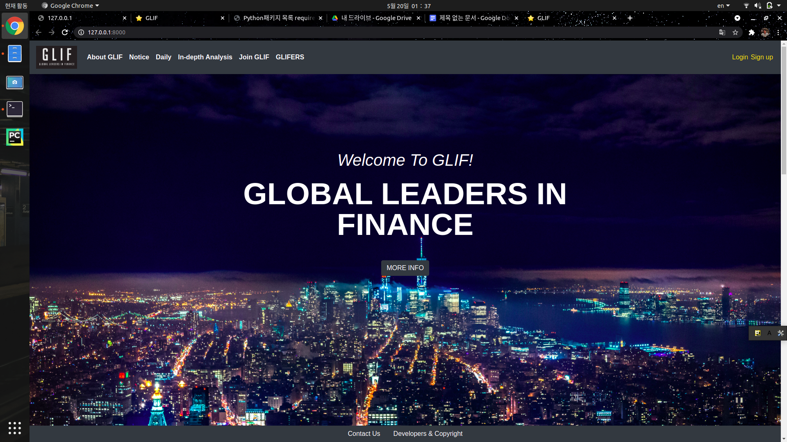

# GLIF Website Project
Website for academic association GLIF of Sungkyunkwan Univ. at Seoul, South Korea.
 
## Project Introduction
This Project aims to build communication channel for GLIFers.



This Project was built using Python Django Project, and plan to provide functionalities such as:
- Introduction of GLIF
- Session Materials
 
## Quick Start
  
### Activate Virtual Environment
Set current directory as this git repo, GLIF_Website_Project.
1. Create venv:
```
python -m venv .venv
```
This command will create a virtual environment with dirname '.venv'

2. Activate
activate using command:
```
$ source .venv/bin/activate
(.venv) $ 
```

3. Create secret keys
Add file named '.env' to the project dir.
Paste the following to the content:
```
SECRET_KEY=secret_key
DEBUG=True
DB_NAME=mysql
DB_USER=db_user
DB_PASSWORD=db_password
DB_HOST=127.0.0.1
ALLOWED_HOSTS=127.0.0.1
```
This just work temporarily. This need to be clarifyed when deploying. 

4. Collect Dependencies. Dependencies are listed in **requirements.txt**, so following command will do necessary tasks.
```
(.venv) $ pip install -r requirements.txt
```

### Run the server
In virtual environment, send the command:
```
(.venv) $ python manage.py runserver
```

And this command will render pages as follows:
```
(.venv) (base) dongmin@dongmin-ThinkPad-E495:~/Projects/GLIF_Website_Project$ python manage.py runserver
Watching for file changes with StatReloader
Performing system checks...

System check identified no issues (0 silenced).

You have 3 unapplied migration(s). Your project may not work properly until you apply the migrations for app(s): auth.
Run 'python manage.py migrate' to apply them.
May 20, 2021 - 01:37:00
Django version 3.1.3, using settings 'website.settings'
Starting development server at http://127.0.0.1:8000/
```
